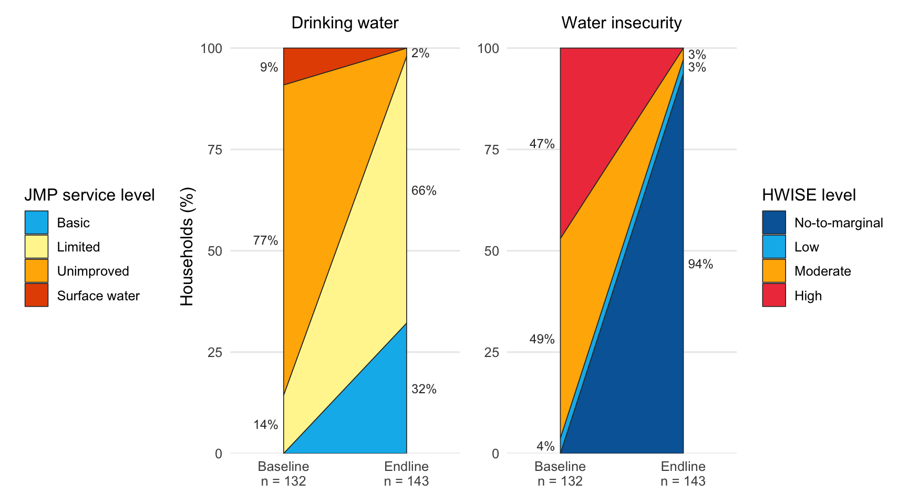

<!-- README.md is generated from README.Rmd. Please edit that file -->

# kalaiwash

<!-- badges: start -->

[](https://creativecommons.org/licenses/by/4.0/)

<!-- badges: end -->

The goal of kalaiwash is to provide the baseline and endline household
survey data of the KALAI water, sanitation and hygiene project of
HELVETAS in Nampula Province, Mozambique. The project was funded by
charity. Baseline data were collected in November 2024 and endline data
in June 2025 in the districts of Larde, Memba, Moma and Mecuburi. The
data describe drinking water sources classified with the WHO/UNICEF
Joint Monitoring Programme (JMP) service ladder, and household water
insecurity measured with the 12-item Household Water Insecurity
Experiences (HWISE) Scale.

## Installation

You can install the development version of kalaiwash from
[GitHub](https://github.com/) with:

``` r
# install.packages("devtools")
devtools::install_github("openwashdata/kalaiwash")
```

Alternatively, you can download the individual datasets as a CSV or XLSX
file from the table below.

1.  Click Download CSV. A window opens that displays the CSV in your
    browser.
2.  Right-click anywhere inside the window and select “Save Page As…”.
3.  Save the file in a folder of your choice.

| dataset | CSV | XLSX |
|:---|:---|:---|
| kalaiwash | [Download CSV](https://github.com/openwashdata/kalaiwash/raw/main/inst/extdata/kalaiwash.csv) | [Download XLSX](https://github.com/openwashdata/kalaiwash/raw/main/inst/extdata/kalaiwash.xlsx) |

## Data

The package provides access to one dataset.

``` r
library(kalaiwash)
```

### kalaiwash

For an overview of the variable names, see the following table. The
`options` column lists the levels of each categorical variable.

<div style="border: 1px solid #ddd; padding: 0px; overflow-y: scroll; height:200px; ">

<table class="table table-striped" style="margin-left: auto; margin-right: auto;">

<thead>

<tr>

<th style="text-align:left;position: sticky; top:0; background-color: #FFFFFF;">

variable_name
</th>

<th style="text-align:left;position: sticky; top:0; background-color: #FFFFFF;">

variable_type
</th>

<th style="text-align:left;position: sticky; top:0; background-color: #FFFFFF;">

description
</th>

<th style="text-align:left;position: sticky; top:0; background-color: #FFFFFF;">

options
</th>

</tr>

</thead>

<tbody>

<tr>

<td style="text-align:left;">

survey_date
</td>

<td style="text-align:left;">

Date
</td>

<td style="text-align:left;">

Date of the interview
</td>

<td style="text-align:left;">

NA
</td>

</tr>

<tr>

<td style="text-align:left;">

survey_type
</td>

<td style="text-align:left;">

factor
</td>

<td style="text-align:left;">

Survey round: Baseline (November 2024) or Endline (June 2025)
</td>

<td style="text-align:left;">

Baseline; Endline
</td>

</tr>

<tr>

<td style="text-align:left;">

district
</td>

<td style="text-align:left;">

factor
</td>

<td style="text-align:left;">

District of Nampula Province where the household is located
</td>

<td style="text-align:left;">

Larde; Memba; Moma; Mecuburi
</td>

</tr>

<tr>

<td style="text-align:left;">

community
</td>

<td style="text-align:left;">

factor
</td>

<td style="text-align:left;">

Name of village
</td>

<td style="text-align:left;">

Cruzamento dos velhos; Jacagiua; Lusaka; Macuire; Matata; Miaja; Mieie;
Monapo; Mpaheia; Namichir; Nanrele; Nihola; Valdemar
</td>

</tr>

<tr>

<td style="text-align:left;">

gender
</td>

<td style="text-align:left;">

factor
</td>

<td style="text-align:left;">

Whether the respondent is male or female
</td>

<td style="text-align:left;">

Female; Male
</td>

</tr>

<tr>

<td style="text-align:left;">

household_size
</td>

<td style="text-align:left;">

numeric
</td>

<td style="text-align:left;">

The number of people living and eating together in the household
including the respondent
</td>

<td style="text-align:left;">

NA
</td>

</tr>

<tr>

<td style="text-align:left;">

source
</td>

<td style="text-align:left;">

factor
</td>

<td style="text-align:left;">

Household’s primary drinking water source
</td>

<td style="text-align:left;">

Borehole with handpump; Protected dug well; Protected dug well with
handpump; Public tap or standpipe; Unprotected dug well; Unprotected
spring; Surface water
</td>

</tr>

<tr>

<td style="text-align:left;">

jmp_improved
</td>

<td style="text-align:left;">

factor
</td>

<td style="text-align:left;">

If the Water source is “improved” or “unimproved” according to the JMP
classification, derived from source: Improved for borehole with
handpump, protected dug well (with or without handpump), public tap or
standpipe, mechanized borehole, protected spring and piped water;
Unimproved otherwise
</td>

<td style="text-align:left;">

Unimproved; Improved
</td>

</tr>

<tr>

<td style="text-align:left;">

jmp_water_service
</td>

<td style="text-align:left;">

factor
</td>

<td style="text-align:left;">

JMP drinking water service level derived from source and
total_collect_time: Surface water; Unimproved (other unimproved source);
Limited (improved source, total collection time over 30 minutes); Basic
(improved source, total collection time of 30 minutes or less)
</td>

<td style="text-align:left;">

Surface water; Unimproved; Limited; Basic
</td>

</tr>

<tr>

<td style="text-align:left;">

collect_yesterday
</td>

<td style="text-align:left;">

factor
</td>

<td style="text-align:left;">

If anyone in the household collected drinking water yesterday
</td>

<td style="text-align:left;">

No; Yes
</td>

</tr>

<tr>

<td style="text-align:left;">

containers_25l
</td>

<td style="text-align:left;">

numeric
</td>

<td style="text-align:left;">

Number of 25 liter containers used to collect water yesterday
</td>

<td style="text-align:left;">

NA
</td>

</tr>

<tr>

<td style="text-align:left;">

containers_20l
</td>

<td style="text-align:left;">

numeric
</td>

<td style="text-align:left;">

Number of 20 liter containers used to collect water yesterday
</td>

<td style="text-align:left;">

NA
</td>

</tr>

<tr>

<td style="text-align:left;">

containers_15l
</td>

<td style="text-align:left;">

numeric
</td>

<td style="text-align:left;">

Number of 15 liter containers used to collect water yesterday
</td>

<td style="text-align:left;">

NA
</td>

</tr>

<tr>

<td style="text-align:left;">

containers_10l
</td>

<td style="text-align:left;">

numeric
</td>

<td style="text-align:left;">

Number of 10 liter containers used to collect water yesterday
</td>

<td style="text-align:left;">

NA
</td>

</tr>

<tr>

<td style="text-align:left;">

containers_5l
</td>

<td style="text-align:left;">

numeric
</td>

<td style="text-align:left;">

Number of 5 liter containers used to collect water yesterday
</td>

<td style="text-align:left;">

NA
</td>

</tr>

<tr>

<td style="text-align:left;">

oneway_travel
</td>

<td style="text-align:left;">

numeric
</td>

<td style="text-align:left;">

Estimate of how long household member had to walk to get to the water
source in minutes (not round-trip)
</td>

<td style="text-align:left;">

NA
</td>

</tr>

<tr>

<td style="text-align:left;">

wait_time
</td>

<td style="text-align:left;">

numeric
</td>

<td style="text-align:left;">

The last time household member went to the source, estimate of how long
to wait to collect water from the source in minutes
</td>

<td style="text-align:left;">

NA
</td>

</tr>

<tr>

<td style="text-align:left;">

total_collect_time
</td>

<td style="text-align:left;">

numeric
</td>

<td style="text-align:left;">

Total collection time in minutes: twice the one-way walk (oneway_travel)
plus the wait time (wait_time)
</td>

<td style="text-align:left;">

NA
</td>

</tr>

<tr>

<td style="text-align:left;">

satisfied
</td>

<td style="text-align:left;">

factor
</td>

<td style="text-align:left;">

Whether the respondent is satisfied with the water service
</td>

<td style="text-align:left;">

Not Satisfied; Satisfied
</td>

</tr>

<tr>

<td style="text-align:left;">

notsatisfied_why
</td>

<td style="text-align:left;">

factor
</td>

<td style="text-align:left;">

Why not satisfied with your water service
</td>

<td style="text-align:left;">

It is broken; It is too expensive; It is too far away; Long lines;
Other; Water has a bad smell, color, or quality; Water tastes bad
</td>

</tr>

<tr>

<td style="text-align:left;">

defecation_place
</td>

<td style="text-align:left;">

factor
</td>

<td style="text-align:left;">

The places that adult men and women in this household defecate
</td>

<td style="text-align:left;">

Latrine/toilet; In the open/no sanitation facilities; In water body:
river or lake
</td>

</tr>

<tr>

<td style="text-align:left;">

handwash_demo
</td>

<td style="text-align:left;">

factor
</td>

<td style="text-align:left;">

Willing to show where and how handwashing happens
</td>

<td style="text-align:left;">

No; Yes
</td>

</tr>

<tr>

<td style="text-align:left;">

soap_ash
</td>

<td style="text-align:left;">

factor
</td>

<td style="text-align:left;">

Household demo uses soap or ash or another cleanser to wash hands
</td>

<td style="text-align:left;">

Soap; Ash; Other cleanser or detergent; None shown
</td>

</tr>

<tr>

<td style="text-align:left;">

water_wash
</td>

<td style="text-align:left;">

factor
</td>

<td style="text-align:left;">

Household demo uses water to wash hands
</td>

<td style="text-align:left;">

No; Yes
</td>

</tr>

<tr>

<td style="text-align:left;">

hwise_worry
</td>

<td style="text-align:left;">

ordered, factor
</td>

<td style="text-align:left;">

In the last 4 weeks, how frequently did you or anyone in your household
worry you would not have enough water for all of your household needs?
</td>

<td style="text-align:left;">

Never (0 times); Rarely (1-2 times); Sometimes (3-10 times); Often
(11-20 times); Always (more than 20 times)
</td>

</tr>

<tr>

<td style="text-align:left;">

hwise_interrupt
</td>

<td style="text-align:left;">

ordered, factor
</td>

<td style="text-align:left;">

In the last 4 weeks, how frequently has your main water source been
interrupted or limited (e.g. water pressure, less water than expected,
river dried up)?
</td>

<td style="text-align:left;">

Never (0 times); Rarely (1-2 times); Sometimes (3-10 times); Often
(11-20 times); Always (more than 20 times)
</td>

</tr>

<tr>

<td style="text-align:left;">

hwise_clothes
</td>

<td style="text-align:left;">

ordered, factor
</td>

<td style="text-align:left;">

In the last 4 weeks, how frequently have problems with water meant that
clothes could not be washed?
</td>

<td style="text-align:left;">

Never (0 times); Rarely (1-2 times); Sometimes (3-10 times); Often
(11-20 times); Always (more than 20 times)
</td>

</tr>

<tr>

<td style="text-align:left;">

hwise_change_plans
</td>

<td style="text-align:left;">

ordered, factor
</td>

<td style="text-align:left;">

In the last 4 weeks, how frequently have you or anyone in your household
had to change schedules or plans due to problems with your water
situation? (e.g. caring for others, household chores, agricultural work,
IGA, sleeping)
</td>

<td style="text-align:left;">

Never (0 times); Rarely (1-2 times); Sometimes (3-10 times); Often
(11-20 times); Always (more than 20 times)
</td>

</tr>

<tr>

<td style="text-align:left;">

hwise_change_meal
</td>

<td style="text-align:left;">

ordered, factor
</td>

<td style="text-align:left;">

In the last 4 weeks, how frequently have you or anyone in your household
had to change what was being eaten because there were problems with
water (e.g., for washing foods, cooking, etc.)?
</td>

<td style="text-align:left;">

Never (0 times); Rarely (1-2 times); Sometimes (3-10 times); Often
(11-20 times); Always (more than 20 times)
</td>

</tr>

<tr>

<td style="text-align:left;">

hwise_nohandwash
</td>

<td style="text-align:left;">

ordered, factor
</td>

<td style="text-align:left;">

In the last 4 weeks, how frequently have you or anyone in your household
had to go without washing hands after dirty activities (e.g., defecating
or changing diapers, cleaning animal dung) because of problems with
water?
</td>

<td style="text-align:left;">

Never (0 times); Rarely (1-2 times); Sometimes (3-10 times); Often
(11-20 times); Always (more than 20 times)
</td>

</tr>

<tr>

<td style="text-align:left;">

hwise_no_bodywash
</td>

<td style="text-align:left;">

ordered, factor
</td>

<td style="text-align:left;">

In the last 4 weeks, how frequently have you or anyone in your household
had to go without washing their body because of problems with water
(e.g., not enough water, dirty, unsafe)?
</td>

<td style="text-align:left;">

Never (0 times); Rarely (1-2 times); Sometimes (3-10 times); Often
(11-20 times); Always (more than 20 times)
</td>

</tr>

<tr>

<td style="text-align:left;">

hwise_drinking
</td>

<td style="text-align:left;">

ordered, factor
</td>

<td style="text-align:left;">

In the last 4 weeks, how frequently has there not been as much water to
drink as you would like for you or anyone in your household?
</td>

<td style="text-align:left;">

Never (0 times); Rarely (1-2 times); Sometimes (3-10 times); Often
(11-20 times); Always (more than 20 times)
</td>

</tr>

<tr>

<td style="text-align:left;">

hwise_angry
</td>

<td style="text-align:left;">

ordered, factor
</td>

<td style="text-align:left;">

In the last 4 weeks, how frequently did you or anyone in your household
feel angry about your water situation?
</td>

<td style="text-align:left;">

Never (0 times); Rarely (1-2 times); Sometimes (3-10 times); Often
(11-20 times); Always (more than 20 times)
</td>

</tr>

<tr>

<td style="text-align:left;">

hwise_sleepthirsty
</td>

<td style="text-align:left;">

ordered, factor
</td>

<td style="text-align:left;">

In the last 4 weeks, how frequently have you or anyone in your household
gone to sleep thirsty because there wasn’t any water to drink?
</td>

<td style="text-align:left;">

Never (0 times); Rarely (1-2 times); Sometimes (3-10 times); Often
(11-20 times); Always (more than 20 times)
</td>

</tr>

<tr>

<td style="text-align:left;">

hwise_nowater
</td>

<td style="text-align:left;">

ordered, factor
</td>

<td style="text-align:left;">

In the last 4 weeks, how frequently has there been no useable or
drinkable water whatsoever in your household?
</td>

<td style="text-align:left;">

Never (0 times); Rarely (1-2 times); Sometimes (3-10 times); Often
(11-20 times); Always (more than 20 times)
</td>

</tr>

<tr>

<td style="text-align:left;">

hwise_shame
</td>

<td style="text-align:left;">

ordered, factor
</td>

<td style="text-align:left;">

In the last 4 weeks, how frequently did you or anyone in your household
feel ashamed/excluded/stigmatized?
</td>

<td style="text-align:left;">

Never (0 times); Rarely (1-2 times); Sometimes (3-10 times); Often
(11-20 times); Always (more than 20 times)
</td>

</tr>

<tr>

<td style="text-align:left;">

hwise_score
</td>

<td style="text-align:left;">

numeric
</td>

<td style="text-align:left;">

Sum of the 12 HWISE items scored Never 0, Rarely 1, Sometimes 2, Often
or Always 3; range 0 to 36
</td>

<td style="text-align:left;">

NA
</td>

</tr>

<tr>

<td style="text-align:left;">

hwise_insecurity_level
</td>

<td style="text-align:left;">

factor
</td>

<td style="text-align:left;">

Water insecurity level from hwise_score: 0 to 2 “No-to-marginal”, 3 to
11 “Low”, 12 to 23 “Moderate”, 24 to 36 “High”
</td>

<td style="text-align:left;">

High; Moderate; Low; No-to-marginal
</td>

</tr>

<tr>

<td style="text-align:left;">

total_liters
</td>

<td style="text-align:left;">

numeric
</td>

<td style="text-align:left;">

Total liters collected in past 24 hours using any water transport
container(s) of any volume(s), derived as 25 \* containers_25l + 20 \*
containers_20l + 15 \* containers_15l + 10 \* containers_10l + 5 \*
containers_5l
</td>

<td style="text-align:left;">

NA
</td>

</tr>

<tr>

<td style="text-align:left;">

liters_person
</td>

<td style="text-align:left;">

numeric
</td>

<td style="text-align:left;">

Liters collected in past 24 hours per household member (total_liters
divided by household_size)
</td>

<td style="text-align:left;">

NA
</td>

</tr>

</tbody>

</table>

</div>

## Example

The example compares the JMP drinking water service level of households
between the baseline and the endline survey.

| JMP service level | Share baseline (%) | Share endline (%) |
|:------------------|-------------------:|------------------:|
| Surface water     |                  9 |                 0 |
| Unimproved        |                 77 |                 2 |
| Limited           |                 14 |                66 |
| Basic             |                  0 |                32 |

<details>

<summary>

Show the code
</summary>

``` r
## Run the following code in console if you don't have the packages
## needed to run the example
## install.packages(c("dplyr", "tidyr", "knitr", "ggplot2", "patchwork"))
library(kalaiwash)
library(dplyr)
library(tidyr)
library(knitr)
library(ggplot2)
library(patchwork)

kalaiwash |> 
  count(survey_type, jmp_water_service, .drop = FALSE) |> 
  group_by(survey_type) |> 
  mutate(share = round(100 * n / sum(n))) |> 
  ungroup() |> 
  select(-n) |> 
  pivot_wider(names_from = survey_type, values_from = share) |> 
  arrange(jmp_water_service) |> 
  kable(col.names = c("JMP service level", "Share baseline (%)", "Share endline (%)"))
```

</details>

The share of households with at least basic drinking water service and
the distribution of HWISE insecurity levels can be compared in the same
way.

| HWISE insecurity level | Share baseline (%) | Share endline (%) |
|:-----------------------|-------------------:|------------------:|
| High                   |                 47 |                 0 |
| Moderate               |                 49 |                 3 |
| Low                    |                  4 |                 3 |
| No-to-marginal         |                  0 |                94 |

<details>

<summary>

Show the code
</summary>

``` r
kalaiwash |> 
  count(survey_type, hwise_insecurity_level, .drop = FALSE) |> 
  group_by(survey_type) |> 
  mutate(share = round(100 * n / sum(n))) |> 
  ungroup() |> 
  select(-n) |> 
  pivot_wider(names_from = survey_type, values_from = share) |> 
  arrange(hwise_insecurity_level) |> 
  kable(col.names = c("HWISE insecurity level", "Share baseline (%)", "Share endline (%)"))
```

</details>

Figure 1 was taken from [Advancing standard WASH metrics with
experiential indicators in
Mozambique](https://github.com/ds4owd-002/project-johnbrogan-alt). The
left panel shows the change in the JMP drinking water service level and
the right panel the change in the HWISE water insecurity level between
the baseline and the endline survey. Each band connects the share of
households in a level at baseline with the share at endline.

<div class="figure" style="text-align: center">


<p class="caption">

Figure 1: Changes in drinking water service and water insecurity
experience between baseline (November 2024) and endline (June 2025).
</p>

</div>

<details>

<summary>

Show the code
</summary>

``` r
# share of households per level and survey round, with the stacking
# positions of each band (best level at the bottom)
level_shares <- function(data, level) {
  data |>
    count(survey_type, level = {{ level }}) |>
    group_by(survey_type) |>
    mutate(percent = 100 * n / sum(n)) |>
    ungroup() |>
    complete(survey_type, level, fill = list(n = 0, percent = 0)) |>
    mutate(level = factor(level, levels = rev(levels(level)))) |>
    arrange(survey_type, level) |>
    group_by(survey_type) |>
    mutate(ymax = cumsum(percent), ymin = ymax - percent,
           ymid = (ymin + ymax) / 2, x = as.integer(survey_type)) |>
    ungroup()
}

# four corners of each band: baseline bottom, baseline top, endline top,
# endline bottom
level_bands <- function(shares) {
  shares |>
    select(level, x, ymin, ymax) |>
    pivot_longer(c(ymin, ymax), names_to = "edge", values_to = "y") |>
    arrange(level, x, if_else(x == 1, y, -y))
}

level_plot <- function(shares, colours, title, legend_title) {
  n_surveys <- shares |>
    group_by(survey_type) |>
    summarise(n = sum(n), .groups = "drop")
  labels <- shares |>
    filter(percent > 0) |>
    mutate(label = paste0(round(percent), "%"),
           x = if_else(x == 1, x - 0.04, x + 0.04),
           hjust = if_else(x < 1, 1, 0))

  ggplot() +
    geom_polygon(data = level_bands(shares),
                 aes(x, y, group = level, fill = level),
                 colour = "grey20", linewidth = 0.3) +
    geom_text(data = labels, aes(x, ymid, label = label, hjust = hjust),
              size = 3.2, colour = "grey20") +
    scale_fill_manual(values = colours, name = legend_title) +
    scale_x_continuous(
      breaks = 1:2, limits = c(0.65, 2.35),
      labels = paste0(n_surveys$survey_type, "\nn = ", n_surveys$n)
    ) +
    scale_y_continuous(breaks = seq(0, 100, 25), expand = expansion(c(0, 0.02))) +
    labs(x = NULL, y = "Households (%)", title = title) +
    theme_minimal(base_size = 12) +
    theme(panel.grid.major.x = element_blank(),
          panel.grid.minor = element_blank(),
          plot.title = element_text(size = 12, hjust = 0.5))
}

p_jmp <- kalaiwash |>
  level_shares(jmp_water_service) |>
  level_plot(
    colours = c("Basic" = "#00B8EC", "Limited" = "#FFF59D",
                "Unimproved" = "#FFB300", "Surface water" = "#E65100"),
    title = "Drinking water", legend_title = "JMP service level"
  ) +
  theme(legend.position = "left")

p_hwise <- kalaiwash |>
  level_shares(hwise_insecurity_level) |>
  level_plot(
    colours = c("No-to-marginal" = "#0066A6", "Low" = "#00B8EC",
                "Moderate" = "#FFB300", "High" = "#EF414A"),
    title = "Water insecurity", legend_title = "HWISE level"
  ) +
  labs(y = NULL)

p_jmp + p_hwise
```

</details>

## License

Data are available as
[CC-BY](https://github.com/openwashdata/kalaiwash/blob/main/LICENSE.md).

## Citation

Please cite this package using:

``` r
citation("kalaiwash")
#> To cite package 'kalaiwash' in publications use:
#> 
#>   Brogan J, Clavijo Daza A (2026). "kalaiwash: Household Water
#>   Insecurity and Drinking Water Service Levels from the KALAI Project
#>   in Nampula, Mozambique." <https://github.com/openwashdata/kalaiwash>.
#> 
#> A BibTeX entry for LaTeX users is
#> 
#>   @Misc{brogan_etall:2026,
#>     title = {kalaiwash: Household Water Insecurity and Drinking Water Service Levels from the KALAI Project in Nampula, Mozambique},
#>     author = {John Brogan and Adriana {Clavijo Daza}},
#>     year = {2026},
#>     url = {https://github.com/openwashdata/kalaiwash},
#>     abstract = {Baseline (November 2024) and endline (June 2025) household survey data from the KALAI water, sanitation and hygiene project of HELVETAS in Larde, Memba, Moma and Mecuburi districts, Nampula Province, Mozambique. The data cover 275 household interviews and include the primary drinking water source classified with the WHO/UNICEF Joint Monitoring Programme (JMP) service ladder, water collection times and volumes, sanitation and handwashing practices, and the 12-item Household Water Insecurity Experiences (HWISE) Scale with its summary score and insecurity level.},
#>     version = {0.0.0.9000},
#>   }
```

## References

Young, S. L., Boateng, G. O., Jamaluddine, Z., et al. (2019). The
Household Water InSecurity Experiences (HWISE) Scale: development and
validation of a household water insecurity measure for low-income and
middle-income countries. *BMJ Global Health*, 4(5), e001750.
<https://doi.org/10.1136/bmjgh-2019-001750>

Frongillo, E. A., Bethancourt, H. J., Miller, J. D., Young, S. L., & the
HWISE Research Coordination Network (2024). Identifying ordinal
categories for the Water Insecurity Experiences Scales. *Journal of
Water, Sanitation and Hygiene for Development*, 14(11), 1066–1078.
<https://doi.org/10.2166/washdev.2024.042>
